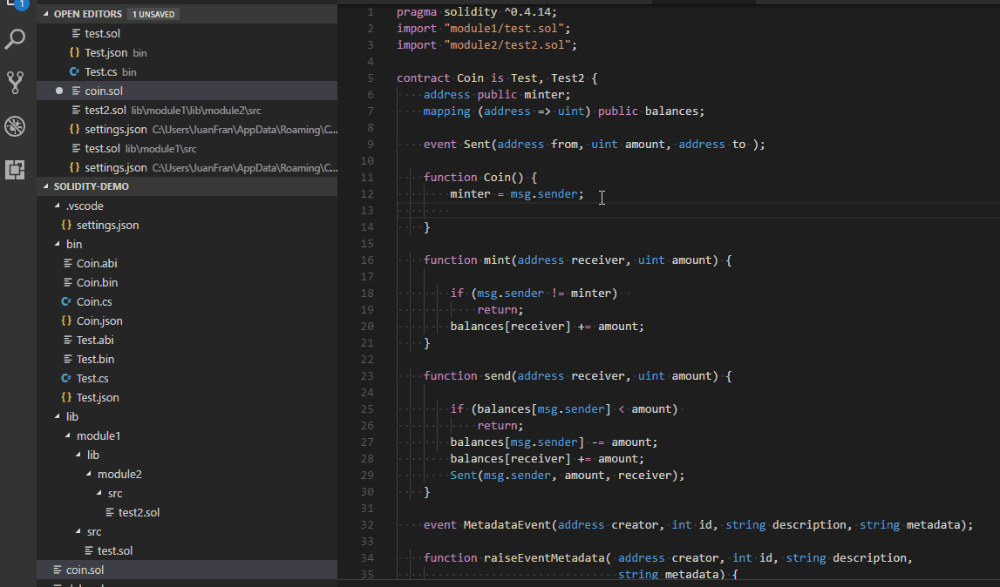

# Solidity support for Visual Studio code
[](https://marketplace.visualstudio.com/items?itemName=juanblanco.solidity)  [](https://marketplace.visualstudio.com/items?itemName=juanblanco.solidity) [](https://marketplace.visualstudio.com/items?itemName=juanblanco.solidity) [](https://marketplace.visualstudio.com/items?itemName=juanblanco.solidity#review-details)

Solidity is the language used in Ethereum to create smart contracts, this extension provides: 

* Syntax highlighting
* Snippets
* Compilation of the current contract (Press F1 Solidity : Compile Current Solidity Contract), or F5 
* Compilation of all the contracts (Press F1 Solidity : Compile all Solidity Contracts), or Ctrl+F5 / Cmd+F5
* Code completion for all contracts / libraries in the current file and all referenced imports
* Default project structure (solidity files needs to be in the 'src' directory, and libraries in the 'lib' directory). Libraries will follow the same structure.
* Compilation supporting EIP82 (dappfile and dependency packages)
* Support for different solidity versions (Remote and local)
* Code generation using https://github.com/Nethereum/Nethereum, it includes currently the default template for Nethereum service, dtos generation. 
  (Open 'contractName.json' after compilation from the bin folder. Press F1 and press Solidity: Code generate from compilation output..)
  Auto generation of Nethereun files on compilation
* Analysis of smart contracts using Mythx
* Linting using Solhint or Solium

# Instructions

## Using a different version of the solidity compiler

Sometimes you may want to use a different compiler than the one provided. All the different versions of the solidity compiler can be found in this repository: You can find all the different versions in the solc-bin repository https://github.com/ethereum/solc-bin/tree/gh-pages/bin

Currently we support three ways supported to use a different version of the solidity compiler.

### Remote download

To compile using a remote version, you need to change the following user setting, with the version required, for example 'latest' or 'v0.4.3+commit.2353da71'

```
"solidity.compileUsingRemoteVersion" : "latest"
```
### Using Local file

If you don't have an internet connection, you can download the compiler and change your user settings to use this.
The local file will be use instead of remote.

```
"solidity.compileUsingLocalVersion" : "C:\\Users\\JuanFran\\Downloads\\soljson-v0.4.15%2Bcommit.bbb8e64f.js"
```

### Npm / node installation
If you need to use an specific version for a project, you can also install solc locally in your solidity project folder.

```
npm install solc 
```

**Note:** The above compilers, have an order of preference when using different settings are: Local node installation (Npm / node installation) will be used first, Local file second and finally remote. 

If you are working on an specific project using an older version, you can use npm install locally to target that specefic version, without affecting the global setting.

But if you want to use the latest version of solidity for all the projects and have online connectivity all the time, use the setting:

```json
"solidity.compileUsingRemoteVersion" : "latest"
```

In case one of your dependencies has a nested dependency on a solc version, effectively breakign the remote version setting from above, you have to disable the node compiler like so:

```json
"solidity.enableLocalNodeCompiler": false
```

## Compiler optimization
Optimize for how many times you intend to run the code. Lower values will optimize more for initial deployment cost, higher values will optimize more for high-frequency usage. The default value is **200**.
```"solidity.compilerOptimization": 200``` 


## Default project structure

A default project  / library dependency structure follows the DappSys library model:


Libraries will have the same name as their folder they are included.
Solidity files will be in the 'src' folder.
Libraries will be included in the 'lib' folder.

Currently there is no name conflicting resolution, so the first library found matching a name, will be the first one used.

The user settings for this structure is:

```
  "solidity.packageDefaultDependenciesContractsDirectory": "src",
  "solidity.packageDefaultDependenciesDirectory": "lib"
```

### OpenZeppelin

If you're using [`@openzeppelin/contracts`](https://github.com/OpenZeppelin/openzeppelin-contracts), the OpenZeppelin Contracts will be found in your node_modules folder, so the user settings will be the following, assuming your solidity project is at root. 

```
  "solidity.packageDefaultDependenciesContractsDirectory": "",
  "solidity.packageDefaultDependenciesDirectory": "node_modules"
```

If you have a deeper structure, like

```
Solution
└───solidity_project
│   │
|   │   xx.sol
│   └───node_modules
│   
└───Nethereum_Project
|   │   xx.cs
|   │   yy.cs
|
└───Web3Js_Project
|   │   xx.js
|   │   yy.js
```

Your user settings configuration will need to represent the full structure:

```
  "solidity.packageDefaultDependenciesContractsDirectory": "",
  "solidity.packageDefaultDependenciesDirectory": "solidity_project/node_modules"
```

## Code completion

Just press Ctrl + Space or Command + Space to autocomplete statements, currently supported all the storage variables, functions and events (with snippets) included in the current document and every document in the import chain. Also supported all the global variables, global functions, types and units.



## Auto compilation and error highlighting

Auto compilation of files and error highlighting can be enabled or disabled using user settings. Also a default delay is implemented for all the validations (compilation and linting) as solidity compilation can be slow when you have many dependencies.

```
"solidity.enabledAsYouTypeCompilationErrorCheck": true,
"solidity.validationDelay": 1500
```


## Linting

### Solhint

To lint Solidity code you can use the Solhint linter https://github.com/protofire/solhint, the linter can be configured it using the following user settings:

```json
"solidity.linter": "solhint",
"solidity.solhintRules": {
  "avoid-sha3": "warn"
}
```

This extension supports `.solhint.json` configuration file. It must be placed to project root 
directory. After any changes in `.solhint.json` it will be synchronized with current IDE 
configuration. 

### Solium

Solium is the default linter of supported by the extesion https://github.com/duaraghav8/Solium, you can configure it using the following user settings:

```json
"solidity.linter": "solium",
"solidity.soliumRules": {
    "quotes": ["error", "double"],
    "indentation": ["error", 4]
},
```

soliumrc.json support will be included in the near future, for specific project linting requirements.

# Analysis of smart contracts with Mythx
You can analyse your smart contracts using Mythx, to start the analysis just open a smart contract and press F1 or Ctrl+Shift+P
and use the command "Solidity: Analyse smart contract with Mythx"

By default the extension will use the trial version, but if you have already a Mythx account you can enter your details using the following settings:

```json
    "mythxvsc.ethAddress": "0x0000000000000000000000000000000000000000",
    "mythxvsc.jwtAccess": "",
    "mythxvsc.jwtRefresh": "",
    "mythxvsc.password": "trial",
    
```
# Formatting using Prettier and the Prettier Solidity Plugin
Formatting is provided thanks to the Prettier plugin for Solidity for more info check https://prettier.io/ and https://github.com/prettier-solidity/prettier-plugin-solidity

Formatting uses the default formatting settings provided by prettier, if you want to provide your custom settings create a **.prettierrc** file as follows

```json
{
  "overrides": [
    {
      "files": "*.sol",
      "options": {
        "printWidth": 80,
        "tabWidth": 4,
        "useTabs": true,
        "singleQuote": false,
        "bracketSpacing": true,
        "explicitTypes": "always"
      }
    }
  ]
}
```

If you would like to format on save, add this entry to your user / workspace settings:

```"editor.formatOnSave": true```

# Code generation Nethereum
The extension integrates with the Nethereum code generator to create Contract integration definitions. You can either generate the api for a single contract, all compiled contracts, or automatically every time you compile a smart contract solidity file.

## Automatic code generation and the Nethereum Code generation settings file.
The simplest way is to automatically code generate your api, for this you need to create a file called "nethereum-gen.settings" at the root of your project, with the following contents.

```json
{
    "projectName": "Solidity.Samples",
    "namespace": "Solidity.Samples",
    "lang":0,
    "autoCodeGen":true,
    "projectPath": "../SoliditySamples"
}
```
"lang" indicates what language to generate the code, 0 = CSharp, 1 = Vb.Net and 3 = FSharp

The "projectName" and "namespace" settings will be used for the manual code generation also.

Use the "projectPath" to set the relative path of your .Net project, this allows to work in a "solution" mode so you can work as an both in Visual Studio Code and Visual Studio (Fat) with your .Net project, or two windows of vscode.

## Single smart contract manual code generation
To code generate the Nethereum contract api from a single smart contract, you need to select the compiled "json" output file from the "bin" folder, press F1 and start typing "Solidity: Code generate" and select what language you want to generate for the current selected file.

## All smart contracts manual code generation
To code generate the Nethereum contract for all smart contracts already compiled, just press F1, and start typing "Solidity: Code generate" and select the option for all contracts for your desired language.

## Contributing / Issues / Requests

For ideas, issues, additions, modifications please raise an issue or a pull request at https://github.com/juanfranblanco/vscode-solidity/
and send a message on gitter at https://gitter.im/vscode-solidity/Lobby or https://gitter.im/Nethereum/Nethereum to get an instant notification.

# Credits

Many thanks to:

Christian Reitwiessner and the Ethereum team for Solidity https://github.com/ethereum/solidity

Raghav Dua and everyone that contributed to Solium, the solidity linter, and the solidity parser.

Ilya Drabenia for creating the Solhint linter and the integration into the extension.

Nexus team for the original creation of the dappfile to structure contracts in projects https://github.com/nexusdev/dapple.

Beau Gunderson for contributing the initial integration of solium  https://github.com/juanfranblanco/vscode-solidity/issues/24, the initial server and error mappings.

Mattia Richetto, Klaus Hott Vidal and Franco Victorio for creating the Prettier Solidity plugin and of course all the developers of Prettier. Please go to https://github.com/prettier-solidity/prettier-plugin-solidity for help and collaboration.

Bram Hoven for starting the multiple package dependency support for different environments (node_modules, lib)

Piotr Szlachciak for refactoring the syntaxes

Forest Fang for providing the implementation of the "Go to definition", allowing you to navigate to structs, contracts, functions calls, etc

Bernardo Vieira for adding the capability to read the solium settings from a file in the workspace root directory.

Mirko Garozzo and Rocky Bernstein for the work on creating and integrating the Mythx api to analyse smart contracts.

Nick Addison, Elazar Gershuni, Joe Whittles, Iñigo Villalba, Thien Toan, Jonathan Carter, Stefan Lew, Nikita Savchenko, Josh Stevens, Paul Berg for their contributions.

Sebastian Bürgel for keeping reminding me of the offline installation suppport

David Krmpotic and Ralph Pichler for the original Sublime extension
https://github.com/davidhq/SublimeEthereum


Everyone for their support and feedback!
