# Solidity support for Visual Studio code
[](https://marketplace.visualstudio.com/items?itemName=juanblanco.solidity)  [](https://marketplace.visualstudio.com/items?itemName=juanblanco.solidity) [](https://marketplace.visualstudio.com/items?itemName=juanblanco.solidity) [](https://marketplace.visualstudio.com/items?itemName=juanblanco.solidity#review-details)

[Solidity](https://soliditylang.org/) is the language used in Ethereum to create smart contracts, this extension provides: 

* Syntax highlighting
* Snippets
* Compilation of the current contract (Press <kbd>F1</kbd> Solidity : Compile Current Solidity Contract), or <kbd>F5</kbd>
* Compilation of all the contracts (Press <kbd>F1</kbd> Solidity : Compile all Solidity Contracts), or <kbd>Ctrl</kbd> + <kbd>F5</kbd> or <kbd>Cmd</kbd> + <kbd>F5</kbd>
* Code completion for all contracts / libraries in the current file and all referenced imports
* Goto definition
* Find all references in project
* Hover information
* Code actions / quick fixes (change compiler, format address, add sdpx license.. )
* Mono repo support (identifies the project by finding the files: remappings.txt, foundry.toml, brownie-config.yaml, truffle-config.js, hardhat.config.js, hardhat.config.ts)
* Default project structure (solidity files needs to be in the `src/` directory, and libraries in the `lib/` directory). Libraries will follow the same structure.
* Compilation supporting EIP82 (dappfile and dependency packages)
* Support for different solidity versions (Remote and local)
* Download source code and Abi from Etherscan
* Code generation using [Nethereum](https://github.com/Nethereum/Nethereum), it includes currently the default template for Nethereum service, dtos generation. 
  (Open 'contractName.json' after compilation from the bin folder. Press <kbd>F1</kbd> and press Solidity: Code generate from compilation output..)
  Auto generation of Nethereum files on compilation
* Linting using [Solhint](https://github.com/protofire/solhint) or [Ethlint](https://github.com/duaraghav8/Ethlint)

It is also available as a standalone LSP:
```sh
npm install -g vscode-solidity-server
vscode-solidity-server --stdio
```

# Instructions


## Using a different version of the solidity compiler

Sometimes you may want to use a different compiler than the one provided. You can find all the different versions in the solc-bin repository https://binaries.soliditylang.org/ 

Currently we support four ways supported to use a different version of the solidity compiler. Remote, Local, NodeModule and Embedded

You can change the compiler, in your user settings or workspace settings.


### Remote download
When selecting remote download the compiler gets downloaded from the solc-bin repository. 

You will need to change the following user setting, with the version required, for example `'latest'` or `'v0.8.18+commit.87f61d96'`, for your workspace user setting (current project) or global user setting (all projects)

```
"solidity.compileUsingRemoteVersion" : "latest"
```
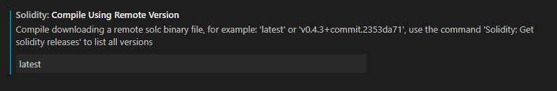

You can simply change this setting using the context menu:

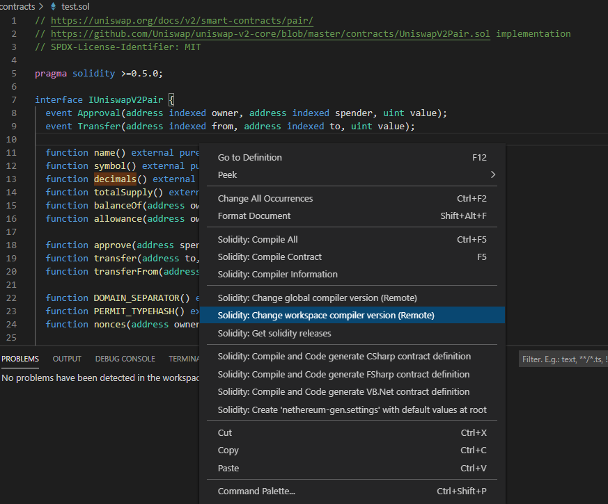 

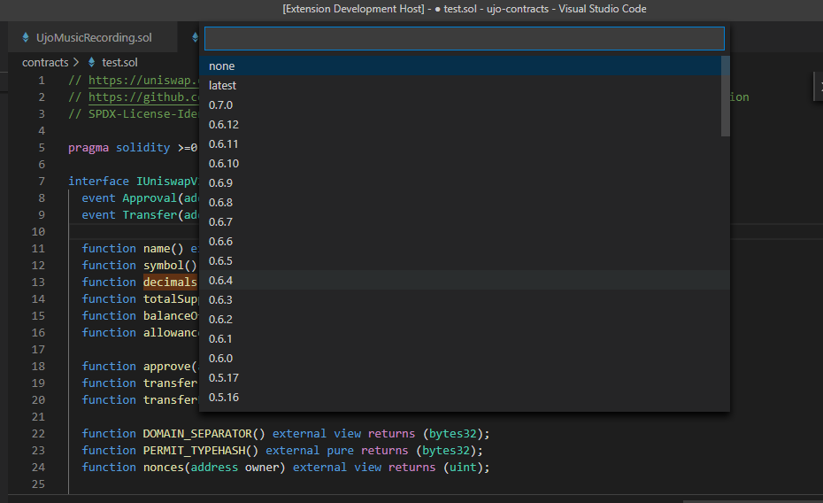 

#### Using a code action
If your code is targetting a specific version for solidity, and see the issue highlighted you can also trigger the menu directly from the import.

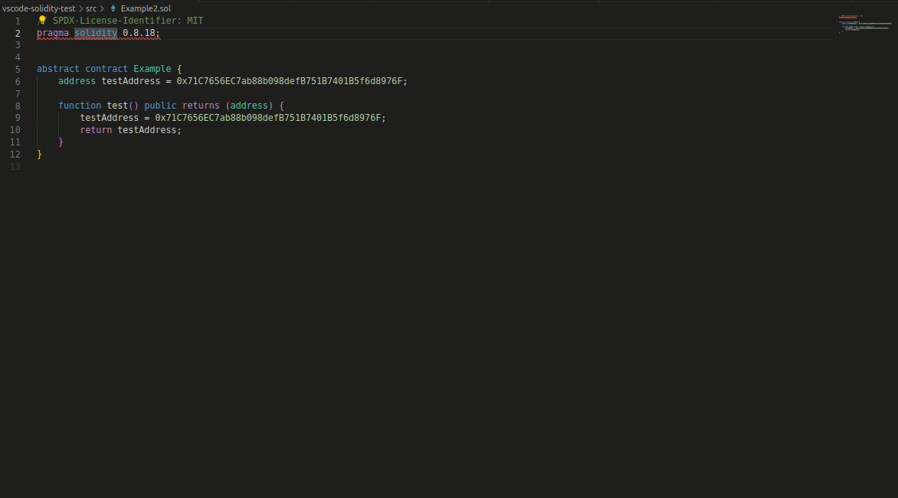

### Using a Local file

If you want to keep a compiler version locally, you can download the compiler from https://binaries.soliditylang.org/ and change your user settings to use this.

```
"solidity.compileUsingLocalVersion" : "C:\\Users\\JuanFran\\Downloads\\soljson-v0.8.18%2Bcommit.87f61d96.js"
```

The simplest way to download a compiler is to use the context menu, this will download your desired version at the root of the project and configure your workspace accordingly.


### Npm / node installation
Another option, is to use the solc npm package in your project, if this is enabled it will try to find the compiler in your configured node_modules at root.

You can install solc using npm at the root of your project as follows.
```
npm install solc 
```

The default module package is "solc", but you may want to use other node module containing a compiler, this can be configured in the settings:


### Compiling a specific contract using a different compiler than the default one.

There might be scenarios, that you want to use a different compiler for a specific file, using one of the other configured compilers. 


## ERC, ERC drafts and Smart contracts snippets / reference

It is pretty hard sometimes to find interfaces or information about an EIP (ERC) or specific libraries to simply get started working with Solidity. 
The solidity extension now includes ERC approved and most drafts (wip) to help get you started.

Just type ```erc``` and select the erc example or interface you want.

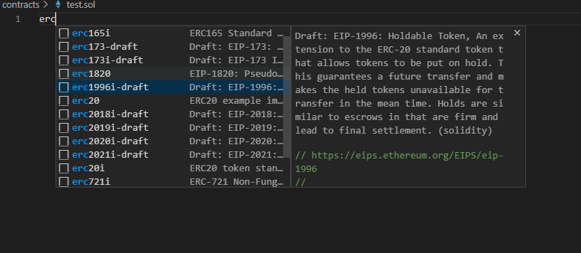
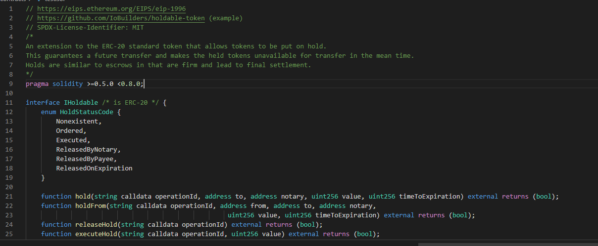

### Smart contract project interfaces 
In a similar to way to ERCs and as we work towards to more interoperable smart contracts, being able to quickly examine those interfaces that you want to integrate is a time saver.

The current release includes the interfaces for Uniswap V2 (to get started), just type ```uni``` to list them all.
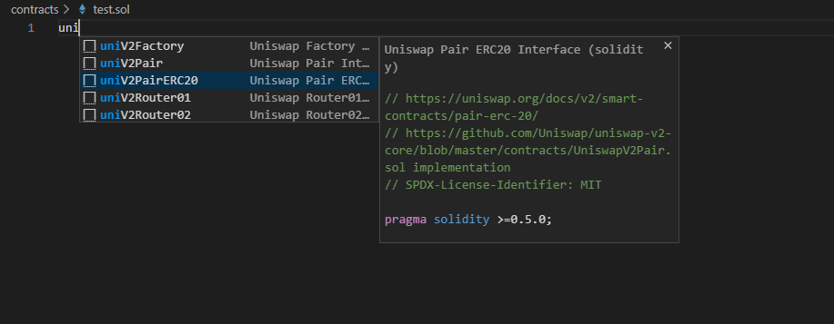 
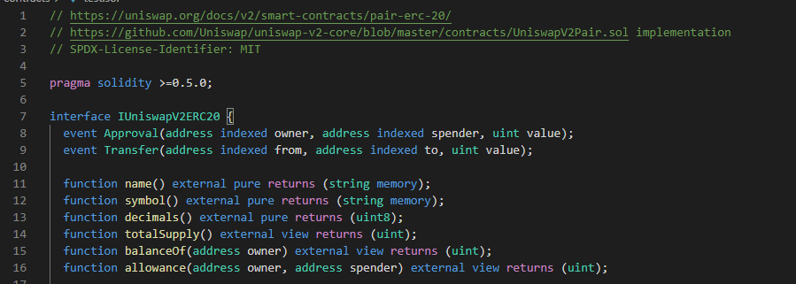

Note: If an ERC or your project is not included, please create a pull request. Note: Only established projets will be included.

## Compiler optimization
Optimize for how many times you intend to run the code. Lower values will optimize more for initial deployment cost, higher values will optimize more for high-frequency usage. The default value is **200**.
```"solidity.compilerOptimization": 200``` 

## Project structure and Remappings

## Mono repo support
Mono repo support enables having different projects in the same workspace as opposed to different open workspaces in the same window.

To provide mono repo support, idenfify the project by finding one of the files used by different tools, for example remappings.txt, foundry.toml, brownie-config.yaml, truffle-config.js, hardhat.config.js. Solidity does not have a standard project file yet, or many not have it ever, so this is the best solution.

The settings enable Mono repo support by default, but if wanted can be disabled.

### Dependencies for both "Node_modules" and "Lib" (Default)

If you're using a library like [`@openzeppelin/contracts`](https://github.com/OpenZeppelin/openzeppelin-contracts), the OpenZeppelin Contracts will be found in your node_modules folder, or you might be using a library like [`Solmate`](https://github.com/transmissions11/solmate) and you might put it in your `lib` folder.
So the user settings will be the following, assuming your solidity project is at root. 

This is the default now, so you don't need to set it.

```
  "solidity.packageDefaultDependenciesContractsDirectory": "",
  "solidity.packageDefaultDependenciesDirectory": ["node_modules", "lib"],
```

If you have a deeper structure, like

```
Solution
└───solidity_project
│   │
|   │   xx.sol
│   └───node_modules
│   
└───Nethereum_Project
|   │   xx.cs
|   │   yy.cs
|
└───Web3Js_Project
|   │   xx.js
|   │   yy.js
```

Your user settings configuration will need to represent the full structure:

```
  "solidity.packageDefaultDependenciesContractsDirectory": "",
  "solidity.packageDefaultDependenciesDirectory": "solidity_project/node_modules"
```

## Dappsys (old ERC)

The project  / library dependency structure can use the DappSys library model, this was the default mode before as it was part of an ERC:

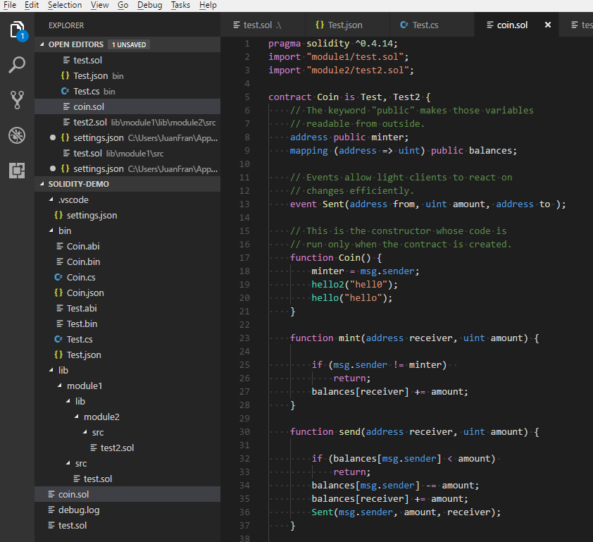

Libraries will have the same name as their folder they are included.
Solidity files will be in the 'src' folder.
Libraries will be included in the 'lib' folder.

Currently there is no name conflicting resolution, so the first library found matching a name, will be the first one used.

The user settings for this structure is:

```
  "solidity.packageDefaultDependenciesContractsDirectory": "src",
  "solidity.packageDefaultDependenciesDirectory": "lib"
```

## Resolving imports from different contract directories shortcuts
There are projects that may have their contracts in the "contracts" directory or you may have a mixture of them that are both in "contracts", "src" or just not specific shortcut. For this the extension internally tries to resolve these generic shortcuts if an import is not found. The default are ["contract", "src", ""]

This behaves in the same way as ```"solidity.packageDefaultDependenciesDirectory": "lib"```. If you see there is a need for other folder names shortcuts, raise an issue.

### Remappings
Another option is to use remappings to define where your dependency libraries are, this can be achieved using the settings or creating a "remappings.txt" file in the root folder. For more info on remappings check the solidity documentation here https://docs.soliditylang.org/en/latest/path-resolution.html?highlight=remapping#import-remapping

If you want to use the solidity user settings for your workspace / global remappings, please include them in the ```solidity.remappings```

```
"solidity.remappings": [
    "@chainlink/=/Users/patrick/.brownie/packages/smartcontractkit/chainlink-brownie-contracts@0.2.2",
    "@openzeppelin/=/Users/patrick/.brownie/packages/OpenZeppelin/openzeppelin-contracts@4.3.2"
  ]
```

Or if you want to include them in the remappings.txt file, just put the file at the root of your project folder. Note: These will override your solidity settings if included


#### Platform specific remappings

There are situations when cross-platform paths are needed, in this case you can use the ```solidity.remappingsWindows``` or ```solidity.remappingsUnix``` settings.

```
  "solidity.remappingsWindows": [
    "@openzeppelin/=C:/Users/<USERNAME>/.brownie/packages/OpenZeppelin/openzeppelin-contracts@4.4.2"
  ],
  
  "solidity.remappingsUnix": [
    "@openzeppelin/=/Users/<USERNAME>/.brownie/packages/OpenZeppelin/openzeppelin-contracts@4.4.2"
  ]
  <<<OR>>> 
  "solidity.remappingsUnix": [
    "@openzeppelin/=/home/<USERNAME>/.brownie/packages/OpenZeppelin/openzeppelin-contracts@4.4.2"
  ]
```

## Code completion

Autocomplete is generally supported across for smart contracts, structs, functions, events, variables, using, inheritance. Autocomplete should happen automatically or press Ctrl+Space or Command+Space in areas like "import".


## Auto compilation and error highlighting

Auto compilation of files and error highlighting can be enabled or disabled using user settings. Also a default delay is implemented for all the validations (compilation and linting) as solidity compilation can be slow when you have many dependencies.

```
"solidity.enabledAsYouTypeCompilationErrorCheck": true,
"solidity.validationDelay": 1500
```

## Go To definition
To navigate to a definition, just press F12 or Ctrl + click to find a definition and navigate to it.

## Hover information
To find more information about a method, function, variable, contract etc, you can just hover over it with your mouse. Natspecs and comments are extracted for all types to provide you all the documentation required.

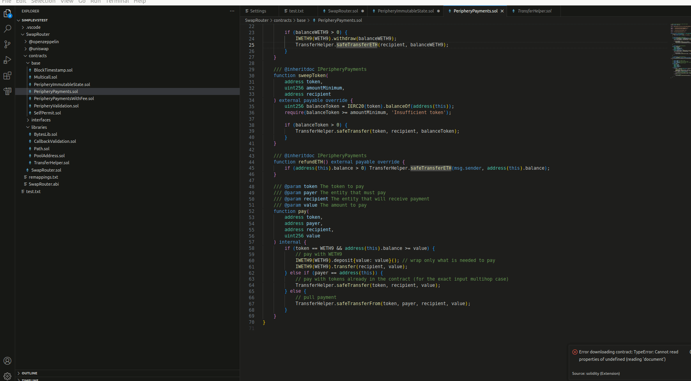

## Goto references
To find all usages of a specific type, method, etc you can press Shift + F12 or right click to find all references


## Code actions / quick fixes
The extension provides some code actions and quick fixes, like change compiler, format address, add sdpx license, feel free to make pull requests with new ones!

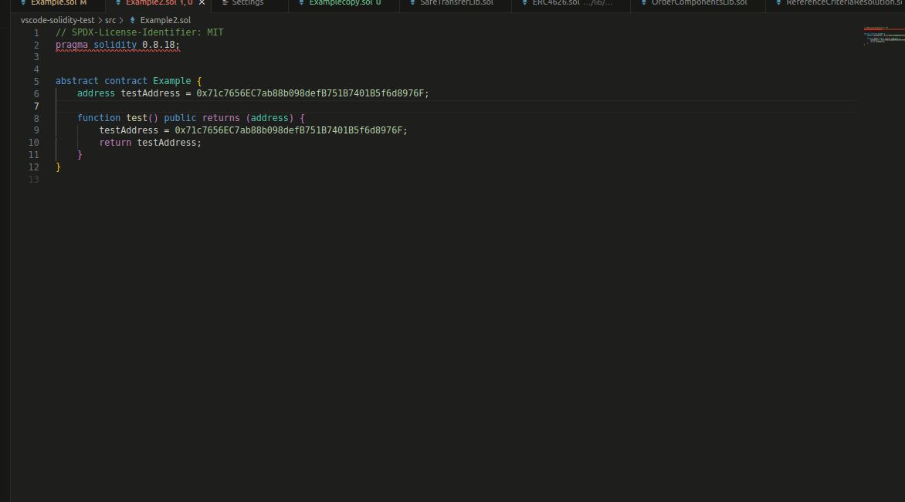

## Download source code and ABI from Etherscan
To download verified source code from Etherscan, you can right click on the folder area or in a soldity file. First select what chain the smart contract it(for example Ethereum) and then input the smart contract address. The source code will be saved in the root folder of your project. Please note that remappings will be generated for multiple files, so these might conflict with existing ones.

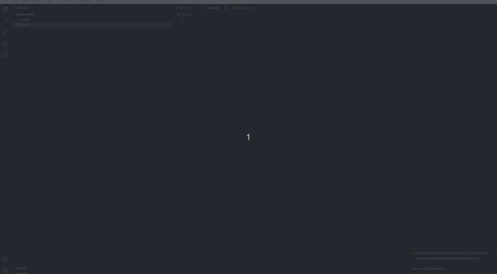

## Solparse-Exp
The extension uses https://github.com/juanfranblanco/solparse-exp as the main parser, this continues the work that many have done over the years. Tim Coulter, @cgewecke, @duaraghav8 @federicobond, as a Peg solidity parser in javascript.

## Linting

There are two linters included with the extension, solhint and solium / ethlint. You can chose your preferred linter using this setting, or disable it by typing ''

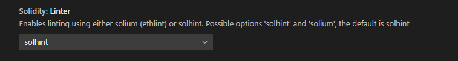

### Solhint

To lint Solidity code you can use the Solhint linter https://github.com/protofire/solhint, the linter can be configured it using the following user settings:

```json
"solidity.linter": "solhint",
"solidity.solhintRules": {
  "avoid-sha3": "warn"
}
```

This extension supports `.solhint.json` configuration file. It must be placed to project root 
directory. After any changes in `.solhint.json` it will be synchronized with current IDE 
configuration. 

This is the default linter now.

NOTE: Solhint plugins are not supported yet.

### Solium / Ethlint

Solium is also supported by the extension https://github.com/duaraghav8/Solium, you can configure it using the following user settings:

```json
"solidity.linter": "solium",
"solidity.soliumRules": {
    "quotes": ["error", "double"],
    "indentation": ["error", 4]
},
```
# Formatting using Prettier and the Prettier Solidity Plugin
Formatting is provided thanks to the Prettier plugin for Solidity for more info check https://prettier.io/ and https://github.com/prettier-solidity/prettier-plugin-solidity

Formatting uses the default formatting settings provided by prettier, if you want to provide your custom settings create a **.prettierrc** file as follows

```json
{
  "overrides": [
    {
      "files": "*.sol",
      "options": {
        "printWidth": 80,
        "tabWidth": 4,
        "useTabs": true,
        "singleQuote": false,
        "bracketSpacing": true,
        "explicitTypes": "always"
      }
    }
  ]
}
```
> :information_source: Settings are applied immediately on the latest version of the plugin. If your settings are not reflected immediately consider updating to the latest version, if it still doesn't work please restart visual studio code.

If you would like to format on save, add this entry to your user / workspace settings:

```"editor.formatOnSave": true```

# Formatting using forge fmt
Formatting can also be performed with `forge fmt` by [Foundry](https://getfoundry.sh/). You can configure it using a `foundry.toml` in your project directory as [explained in the Foundry book](https://book.getfoundry.sh/reference/config/formatter?highlight=fmt#formatter) and then choosing `forge` as your formatter in the extension settings:


# Code generation Nethereum
The extension integrates with the Nethereum code generator to create Contract integration definitions. You can either generate the api for a single contract, all compiled contracts, or automatically every time you compile a smart contract solidity file.

The simplest way to code generate a the contract definition for a smart contract is to right click and select the project / language you require:


## Automatic code generation and the Nethereum Code generation settings file.
If you want to automatically code generate your api, every time to you compile, you can do this creating a file "nethereum-gen.settings" at the root of your project, with the following contents. You can create it automatically using the context menu too.

```json
{
    "projectName": "Solidity.Samples",
    "namespace": "Solidity.Samples",
    "lang":0,
    "autoCodeGen":true,
    "projectPath": "../SoliditySamples"
}
```


"lang" indicates what language to generate the code, 0 = CSharp, 1 = Vb.Net and 3 = FSharp

The "projectName" and "namespace" settings will be used for the manual code generation also.

Use the "projectPath" to set the relative path of your .Net project, this allows to work in a "solution" mode so you can work as an both in Visual Studio Code and Visual Studio (Fat) with your .Net project, or two windows of vscode.

## Abi contract code generation
You may have only the abi of a smart contract and want to code generate the contract definition. Just create a file containing the abi, with the extension ```.abi``` and another with the ```.bin``` content (if needed) and use this context menu. 

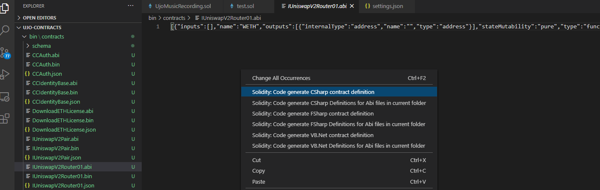


## Single smart contract manual code generation/
To code generate the Nethereum contract api from a single smart contract, you need to select the compiled "json" output file from the "bin" folder, press F1 and start typing "Solidity: Code generate" and select what language you want to generate for the current selected file.

## All smart contracts manual code generation
To code generate the Nethereum contract for all smart contracts already compiled, just press F1, and start typing "Solidity: Code generate" and select the option for all contracts for your desired language.

Here's the updated section for the **VSCode Solidity** extension's `README.md`, including the note that multiple `nethereum-gen.multisettings` files can be used, and explaining that they need to be prefixed if desired:

---

## Code Generation with `.nethereum-gen.multisettings`

The Solidity extension for VSCode supports advanced contract code generation through configuration files like `.nethereum-gen.multisettings`. These files allow you to define multiple code generation settings for your smart contracts, enabling the generation of client-side code for various platforms (e.g., C#, Unity Coroutines)  based on Solidity ABI files.

To generate the code just right click on the file as demonstrated here:

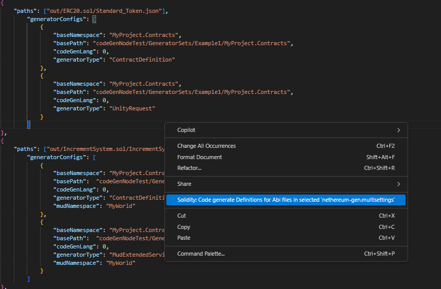

You can have **multiple `nethereum-gen.multisettings` files** for different projects, modules, or environments by prefixing the file name as needed (e.g., `project1.nethereum-gen.multisettings`, `moduleX.nethereum-gen.multisettings`). This allows for flexibility in organizing large projects with distinct code generation needs.

A typical `.nethereum-gen.multisettings` file uses the following structure:

Note: DO NOT INCLUDE THE COMMENTS
```json
[
    {
        "paths": ["out/ERC20.sol/Standard_Token.json"],
        "generatorConfigs": [
            {
                "baseNamespace": "MyProject.Contracts",
                "basePath": "codeGenNodeTest/GeneratorSets/Example2/MyProject.Contracts",
                "codeGenLang": 0,  // Code generation for C#
                "generatorType": "ContractDefinition"  // Generates contract definitions in C#
            },
            {
                "baseNamespace": "MyProject.Contracts",
                "basePath": "codeGenNodeTest/GeneratorSets/Example2/MyProject.Contracts",
                "codeGenLang": 0,  // Code generation for C#
                "generatorType": "UnityRequest"  // Generates Unity client request code
            }
        ]
    },
    {
        "paths": ["out/IncrementSystem.sol/IncrementSystem.json"],
        "generatorConfigs": [
            {
                "baseNamespace": "MyProject.Contracts.MyWorld1.Systems",
                "basePath": "codeGenNodeTest/GeneratorSets/Example2/MyProject.Contracts.MyWorld1.Systems",
                "codeGenLang": 0,  // Code generation for C#
                "generatorType": "ContractDefinition"
            },
            {
                "baseNamespace": "MyProject.Contracts.MyWorld1.Systems",
                "basePath": "codeGenNodeTest/GeneratorSets/Example2/MyProject.Contracts.MyWorld1.Systems",
                "codeGenLang": 0,
                "generatorType": "MudExtendedService",  // Generates Mud services
                "mudNamespace": "myworld1"
            }
        ]
    },
    {
        "paths": ["mudMultipleNamespace/mud.config.ts"],
        "generatorConfigs": [
            {
                "baseNamespace": "MyProject.Contracts.MyWorld1.Tables",
                "basePath": "codeGenNodeTest/GeneratorSets/Example2/MyProject.Contracts.MyWorld1.Tables",
                "generatorType": "MudTables",  // Generates Mud tables
                "mudNamespace": "myworld1"
            }
        ]
    },
    {
        "paths": ["mudMultipleNamespace/mud.config.ts"],
        "generatorConfigs": [
            {
                "baseNamespace": "MyProject.Contracts.MyWorld2.Tables",
                "basePath": "codeGenNodeTest/GeneratorSets/Example2/MyProject.Contracts.MyWorld2.Tables",
                "generatorType": "MudTables",
                "mudNamespace": "myworld2"
            }
        ]
    }
]
```

### Key Configuration Fields

- **`paths`**: Points to the ABI or config files generated from Solidity contracts or Mud system configurations.
- **`generatorConfigs`**: Specifies how the code should be generated.
  - **`baseNamespace`**: The root namespace for generated code (e.g., `MyProject.Contracts`).
  - **`basePath`**: The output path for the generated code files.
  - **`codeGenLang`**: Specifies the language for code generation (e.g., `0` for C#).
  - **`generatorType`**: Determines the type of code to generate:
    - `"ContractDefinition"`: Generates contract classes.
    - `"UnityRequest"`: Generates Unity Request (Coroutines) code for interacting with contracts. NOTE: Async is now the preferred option.
    - `"MudExtendedService"`: Generates services for the Mud system.
    - `"MudTables"`: Generates table-related code for the Mud framework.
  - **`mudNamespace`**: Specifies the namespace for Mud system-related code.

### Usage

1. Define your code generation settings in one or more `nethereum-gen.multisettings` files.
2. Each file can independently specify multiple generator configurations for different languages or platforms, such as Unity or C#.
3. When using multiple files, prefix the `nethereum-gen.multisettings` files with a project or module name (e.g., `project1.nethereum-gen.multisettings`, `moduleX.nethereum-gen.multisettings`) to separate different configurations.
4. When the code generation tool runs, it will generate the code according to the settings in the files, creating contract classes, services, or Unity client code depending on your configuration.


## Contributing / Issues / Requests

For ideas, issues, additions, modifications please raise an issue, if your change is significant please head to the Netherum discord for a chat https://discord.gg/u3Ej2BReNn. 
Note: All contributions will be under the same project license.

# Credits

Many thanks to:

Christian Reitwiessner and the Ethereum team for Solidity https://github.com/ethereum/solidity, for their amazing and none stop work. Thanks to them Ethereum and all the other EVM compatible chains are they way they are. This extension piggybacks on their work.

Raghav Dua and everyone that contributed to Solium, the solidity linter, and the solidity parser.

Ilya Drabenia for creating the Solhint linter and the integration into the extension.

Nexus team for the original creation of the dappfile to structure contracts in projects https://github.com/nexusdev/dapple.

Beau Gunderson for contributing the initial integration of solium  https://github.com/juanfranblanco/vscode-solidity/issues/24, the initial server and error mappings.

Mattia Richetto, Klaus Hott Vidal and Franco Victorio for creating the Prettier Solidity plugin and of course all the developers of Prettier. Please go to https://github.com/prettier-solidity/prettier-plugin-solidity for help and collaboration.

Bram Hoven for starting the multiple package dependency support for different environments (node_modules, lib)

Piotr Szlachciak for refactoring the syntaxes

James Lefrere for further refactoring the syntaxes.

Forest Fang for providing the first implementation of the "Go to definition", allowing you to navigate to structs, contracts, functions calls, etc and we have used for years.

Bernardo Vieira for adding the capability to read the solium settings from a file in the workspace root directory.

@llllvvuu for all the contributions to make the standalone language server support

Mirko Garozzo and Rocky Bernstein for the work on creating and integrating the Mythx api to analyse smart contracts (OBSOLETE NOW)

Nick Addison, Elazar Gershuni, Joe Whittles, Iñigo Villalba, Thien Toan, Jonathan Carter, Stefan Lew, Nikita Savchenko, Josh Stevens, Paul Berg for their contributions.

Sebastian Bürgel for keeping reminding me of the offline installation suppport

David Krmpotic and Ralph Pichler for the original Sublime extension
https://github.com/davidhq/SublimeEthereum


Everyone for their support and feedback!
